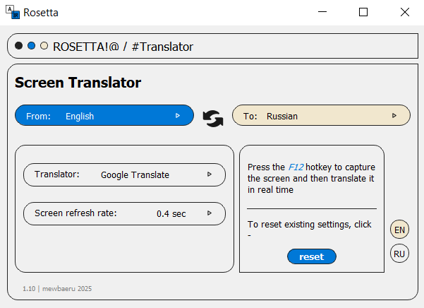

# screen-translator

[](https://www.python.org/)
[](https://www.riverbankcomputing.com/software/pyqt/)
[](https://github.com/PaddlePaddle/PaddleOCR)

**Screen Translator** is a Python desktop app that lets you translate text directly from your computer screen. Select an area on the screenshot, and the app will recognize the text and translate it into the desired language.

<p align="center">
  
</p>

> [!NOTE]
> To improve performance, you should increase the interval between screen refreshes.
--- 

# Usage

### 1. Clone the repository:
```
git clone https://github.com/vishnevvskaya/screen-translator.git
cd screen-translator
```
### 2. Install the required modules:
```
pip install -r requirements.txt
```
### 3. Install the Paddlepaddle
You can use the official [instructions](https://www.paddlepaddle.org.cn/en/install/quick?docurl=/documentation/docs/en/develop/install/pip/windows-pip_en.html) on the official [website](https://www.paddlepaddle.org.cn/en)
### 4. Download PaddleOCR models
- Run the download script to get models directly into your project folder
```
python download_models.py
```
- Copy the models from `C:\Users\<YourUsername>\.paddlex\official_models` to the application directory
```
Copy-Item -Path "C:\Users\<YourUsername>\.paddlex\official_models\*" -Destination "paddle_models\" -Recurse -Force
```
### 5. Running the application
```
python main.py
```
